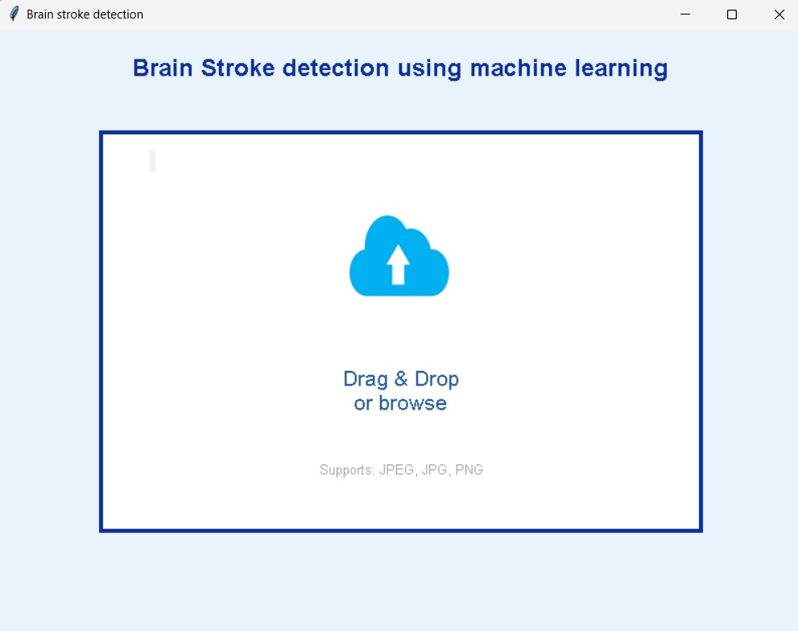
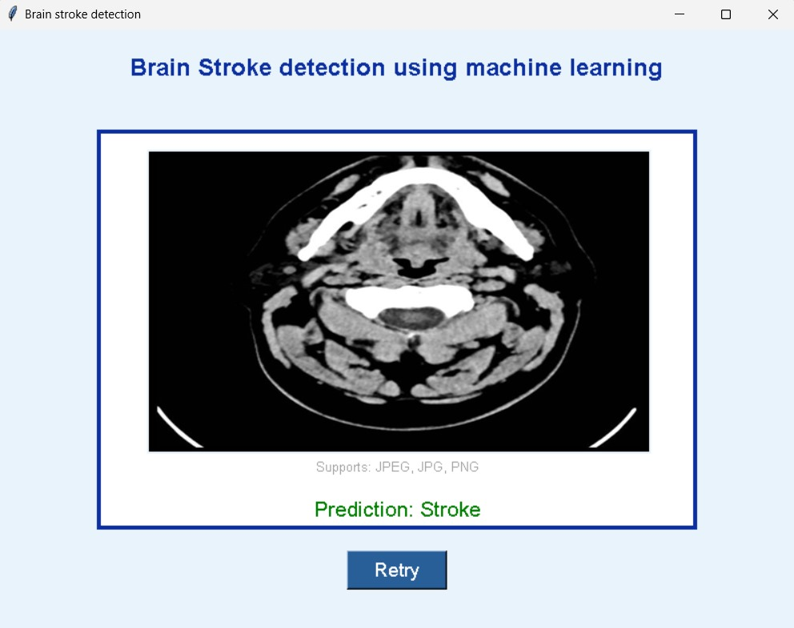
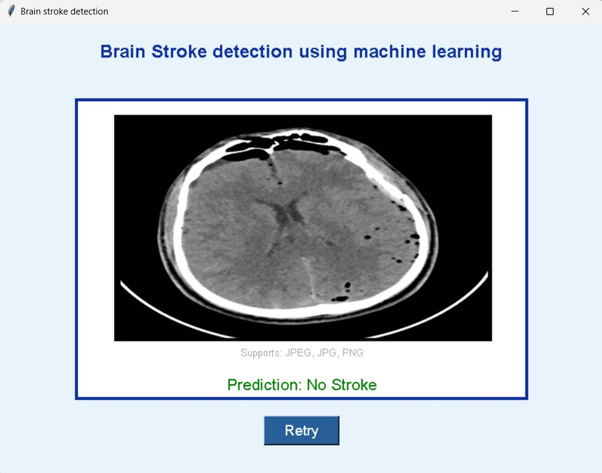
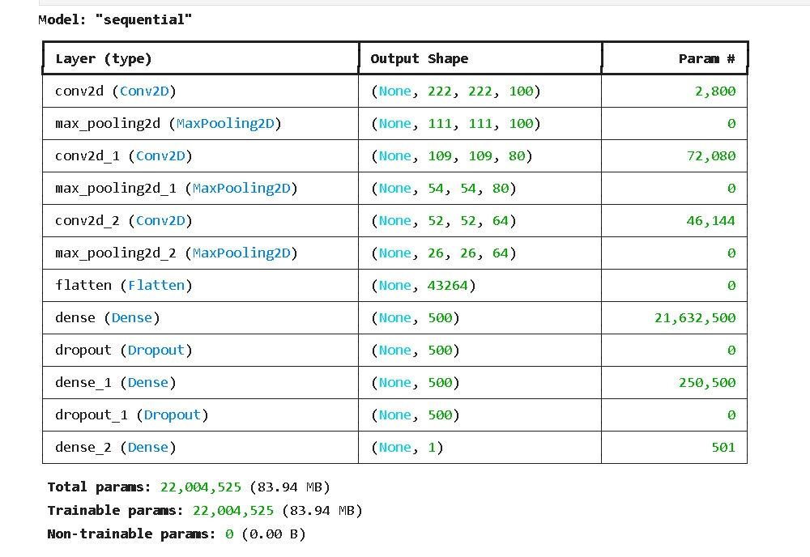
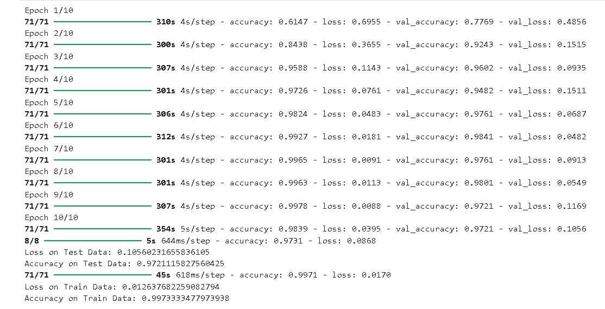

# Brain Stroke Detection Using CNN 

## Demo Video

Watch the demo video to see the Brain Stroke Detection model in action:


## Project Overview

This project focuses on detecting brain strokes using machine learning techniques, specifically a Convolutional Neural Network (CNN) algorithm. The model is trained on a dataset of CT scan images to classify images as either "Stroke" or "No Stroke". The dataset was sourced from Kaggle, and the project uses TensorFlow for model development and now utilizes React.js for the frontend and FastAPI for the backend.

### Key Features:
- **Machine Learning Model**: CNN model built using TensorFlow for classifying brain strokes based on CT scan images.
- **User Interface**: React.js frontend for easy image uploading and displaying predictions.
- **Backend**: FastAPI serves the model for predictions and handles image processing.
- **Visualization**: Includes model performance metrics such as accuracy, ROC curve, PR curve, and confusion matrix.

### Dataset:
- **Source**: [Kaggle - Brain Stroke CT Image Dataset](https://www.kaggle.com/datasets/afridirahman/brain-stroke-ct-image-dataset)
- **Classes**: The dataset contains two categories:
  - **Normal** (No Stroke)
  - **Stroke** (Brain Stroke)

## Project Structure

### Model Architecture

The CNN model architecture consists of:
- 3 Convolutional layers with ReLU activation and MaxPooling.
- 2 Dense layers of 500 units with ReLU activation.
- Dropout layers (20%) for regularization.
- A final dense layer with a sigmoid activation function for binary classification.

**Training**: The model was trained on images resized to 224x224 pixels, normalized for optimal learning.

### Evaluation Metrics:

- **Accuracy on Test Data**: 90%+
- **ROC and PR Curves**: Graphical metrics to evaluate the model's performance.
- **Loss and Accuracy**: Tracked during training for both training and validation sets.

## How to Use the Project

### Project Setup

1. **Clone the Repository**:
   - Clone the project repository to your local machine:
   ```bash
   git clone https://github.com/kishorgs/BrainStrokeDetection.git
   ```

2. **Navigate to Frontend Directory**:
   - Change to the frontend directory:
   ```bash
   cd frontend
   ```

3. **Install Frontend Dependencies**:
   - Install the required libraries for the React.js frontend:
   ```bash
   npm install
   ```

4. **Run the Frontend**:
   - Start the React.js frontend:
   ```bash
   npm start
   ```
   - The React application will run on `http://localhost:3000`.

5. **Navigate to Backend Directory**:
   - In a new terminal window, change to the backend directory:
   ```bash
   cd backend
   ```

6. **Install Backend Dependencies**:
   - Install the required libraries for the FastAPI backend:
   ```bash
   pip install -r requirements.txt
   ```

7. **Build the model**
   - Install the required libraries for model building.
   ```bash
   pip install -r model_requirements.txt
   ```

   - Then download the dataset folder in backend folder
   - Then run **model.ipynb** code
   - Model will be dowloaded in the same backedn folder as **stroke_detection_model.h5**
     
8. **Run the Backend**:
   - Start the FastAPI server:
   ```bash
   uvicorn main:app --reload
   ```
   - The FastAPI backend will run on `http://localhost:8000`.

### Frontend Requirements

- **React.js**
- **Axios**
- **Tailwind CSS**
- **FontAwesome for icons**

Install the frontend dependencies using npm or yarn:
```bash
npm install react react-dom axios @fortawesome/react-fontawesome @fortawesome/free-solid-svg-icons tailwindcss autoprefixer postcss
```

### Backend Requirements

- **FastAPI**
- **Uvicorn**
- **TensorFlow**
- **Pillow**
- **NumPy**

Install the backend dependencies via `pip`:
```bash
pip install fastapi uvicorn tensorflow pillow numpy
```

### Model Requirements

To build the CNN model, the following Python libraries are used:
- **warnings**
- **os**
- **NumPy**
- **Matplotlib**
- **Scikit-learn**
- **Pillow (PIL)**
- **TensorFlow**

Install them using `pip`:
```bash
pip install numpy matplotlib scikit-learn pillow tensorflow
```

### Running the Project

1. **Training the Model**:
   - The project code automatically splits the dataset and trains the model.
   - The model is saved as `stroke_detection_model.h5` after training.

2. **Running the FastAPI Backend**:
   - Start the FastAPI server using Uvicorn:
   ```bash
   uvicorn main:app --reload
   ```

3. **Using the React.js Frontend**:
   - Run the React.js frontend application, which allows you to upload a CT scan image and displays the prediction.
   - Use the Axios library in the frontend to send the image to the FastAPI backend for prediction.

### Screenshots

**Main Interface**:
- The application allows you to upload a CT scan image and provides the prediction.
  


**Output Screens**:
- Predictions will show either "Stroke" or "No Stroke" based on the uploaded image.

Stroke output :



No Stroke output :



**Model Summary**:
- A detailed architecture overview of the CNN model.



**Training Epochs**:
- Visual representation of accuracy and loss during model training.



**Performance Metrics**:
- ROC and PR curve graphs to evaluate the performance of the model.


## Results

- The CNN model achieves over 97% accuracy on the test data.
- **ROC Curve**: The model shows good discriminative ability in predicting strokes.
- **PR Curve**: Precision and recall metrics indicate strong performance, especially for stroke detection.
  
### Confusion Matrix:
- A confusion matrix indicates how well the model classifies stroke and non-stroke cases.

## Conclusion

This project successfully implements a machine learning model for detecting brain strokes using CT scan images. The developed React.js frontend allows easy image uploading and prediction, while FastAPI ensures a smooth backend API for serving the model. Further improvements could involve testing the model on a larger dataset and optimizing the architecture.
